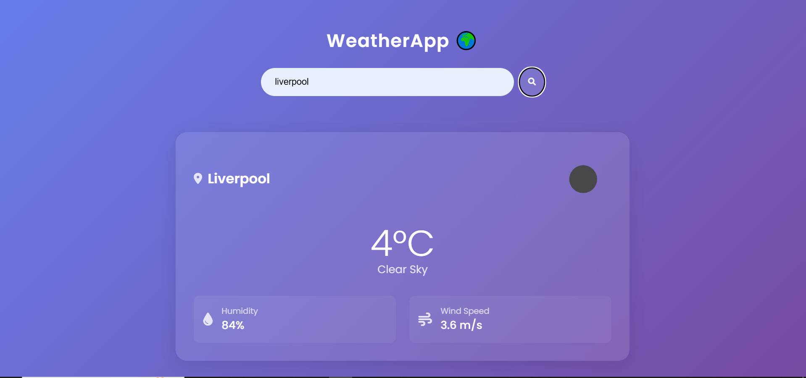
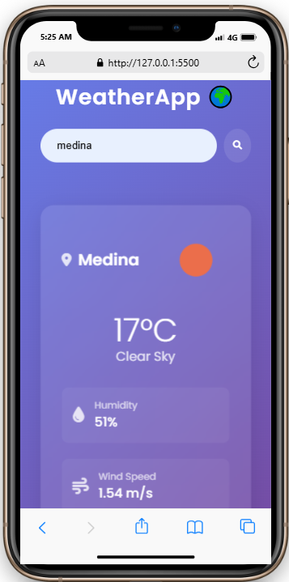

# WeatherApp 🌤️
A real-time weather application built with HTML, CSS, JavaScript, and OpenWeatherMap API.

## Features
- Search by city name
- Temperature, humidity, wind speed, and description
- Responsive design
- Error handling

## Technologies Used
- HTML5
- CSS3
- JavaScript (ES6+)
- OpenWeatherMap API

## Live Demo
[View on Vercel](https://weather-app-kappa-ten-78.vercel.app/)

## Challenges Faced
- Handling API rate limits
- Dynamic icon rendering
- Responsive design for mobile

## Future Improvements
- Add 5-day forecast
- Geolocation support
- Temperature unit toggle (°C/°F)

## Code Snippets

```javascript
// Real code example
async function fetchWeather(city) {
    try {
        const response = await fetch(
            `https://api.openweathermap.org/data/2.5/weather?q=${city}&units=metric&appid=${API_KEY}`
        );
        if (!response.ok) throw new Error('City not found');
        const data = await response.json();
        updateUI(data);
    } catch (err) {
        showError();
    }
}
```

## Screenshots

